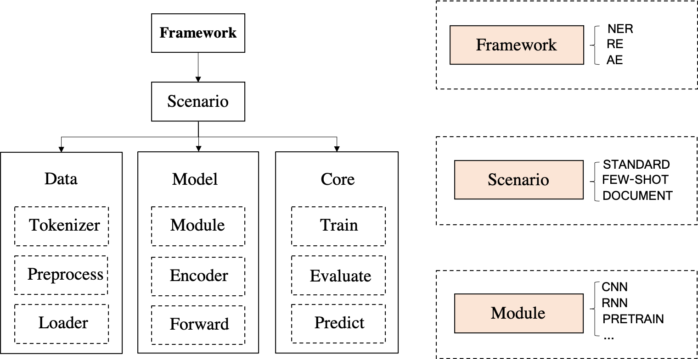

Start
=====

Model Framework
---------------

DeepKE contains three modules for named entity recognition, relation extraction and attribute extraction, the three tasks respectively.

Each module has its own submodules. For example, there are standard, document-level and few-shot submodules in the attribute extraction modular.

Each submodule compose of three parts: a collection of tools, which can function as tokenizer, dataloader, preprocessor and the like, a encoder and a part for training and prediction

Dataset
-------

We use the following datasets in our experiments:

+--------------------------+-----------+------------------+----------+------------+
| Task                     | Settings  | Corpus           | Language |  Model     |
+==========================+===========+==================+==========+============+
|                          |           | CoNLL-2003       | English  |            |
|                          | Standard  +------------------+----------+  BERT      |
|                          |           | People's Daily   | Chinese  |            |
|                          +-----------+------------------+----------+------------+
|                          |           | CoNLL-2003       |          |            |
|                          |           +------------------+          |            |
| Name Entity Recognition  |           | MIT Movie        |          |            |
|                          | Few-shot  +------------------+ English  | LightNER   |
|                          |           | MIT Restaurant   |          |            |
|                          |           +------------------+          |            |
|                          |           | ATIS             |          |            |  
+--------------------------+-----------+------------------+----------+------------+
|                          |           |                  |          | CNN        |
|                          |           |                  |          +------------+
|                          |           |                  |          | RNN        |
|                          |           |                  |          +------------+
|                          |           |                  |          | Capsule    |
|                          | Standard  | DuIE             | Chinese  +------------+
|                          |           |                  |          | GCN        |
|                          |           |                  |          +------------+
|                          |           |                  |          | Transformer|
|                          |           |                  |          +------------+
|                          |           |                  |          | BERT       |
|                          +-----------+------------------+----------+------------+
| Relation Extraction      |           | SEMEVAL(8-shot)  |          |            |
|                          |           +------------------+          |            |
|                          |           | SEMEVAL(16-shot) |          |            |
|                          | Few-shot  +------------------+ English  | KnowPrompt |
|                          |           | SEMEVAL(32-shot) |          |            |
|                          |           +------------------+          |            |
|                          |           | SEMEVAL(Full)    |          |            |
|                          +-----------+------------------+----------+------------+
|                          |           | DocRED           |          |            |
|                          |           +------------------+          |            |
|                          | Document  | CDR              | English  | DocuNet    |
|                          |           +------------------+          |            |
|                          |           | GDA              |          |            |
+--------------------------+-----------+------------------+----------+------------+   
|                          |           |                  |          | CNN        |
|                          |           |                  |          +------------+
|                          |           |                  |          | RNN        |
|                          |           |                  |          +------------+
|                          |           |Triplet Extraction|          | Capsule    |
| Attribute Extraction     | Standard  |Dataset           | Chinese  +------------+
|                          |           |                  |          | GCN        |
|                          |           |                  |          +------------+
|                          |           |                  |          | Transformer|
|                          |           |                  |          +------------+
|                          |           |                  |          | BERT       |
+--------------------------+-----------+------------------+----------+------------+

The datasets' formats are as follow:

Standard NER:

Dataset needs to be input as ``TXT`` file, the data's format of file needs to comply with the following：

杭 B-LOC

州 I-LOC

真 O

美 O

Few-shot NER:

Dataset needs to be input as ``TXT`` file, the data's format of file needs to comply with the following：

EU	B-ORG

rejects	O

German	B-MISC

call	O

to	O

boycott	O

British	B-MISC

lamb	O

.	O

Standard RE:

Dataset needs to be input as ``CSV`` file.

The data's format of file needs to comply with the following：

+--------------------------+-----------+------------+-------------+------------+------------+
| Sentence                 | Relation  | Head       | Head_offset |  Tail      | Tail_offset|
+--------------------------+-----------+------------+-------------+------------+------------+

The relation's format of file needs to comply with the following：

+------------+-----------+------------------+-------------+
| Head_type  | Tail_type | relation         | Index       |
+------------+-----------+------------------+-------------+

Few-shot RE:

Dataset needs to be input as ``TXT`` file and ``JSON`` file.

The data's format of file needs to comply with the following：

{"token": ["the", "most", "common", "audits", "were", "about", "waste", "and", "recycling", "."], "h": {"name": "audits", "pos": [3, 4]}, "t": {"name": "waste", "pos": [6, 7]}, "relation": "Message-Topic(e1,e2)"}

The relation's format of file needs to comply with the following：

{"Other": 0 , "Message-Topic(e1,e2)": 1 ... }

Document RE:

Dataset needs to be input as ``JSON`` file

The data's format of file needs to comply with the following：

[{"vertexSet": [[{"name": "Lark Force", "pos": [0, 2], "sent_id": 0, "type": "ORG"}, {"sent_id": 3, "type": "ORG", "pos": [2, 4], "name": "Lark Force"}, {"name": "Lark Force", "pos": [3, 5], "sent_id": 4, "type": "ORG"}], [{"name": "Australian Army", "pos": [4, 6], "sent_id": 0, "type": "ORG"}], [{"pos": [9, 11], "type": "TIME", "sent_id": 0, "name": "March 1941"}], [{"name": "World War II", "pos": [12, 15], "sent_id": 0, "type": "MISC"}], [{"name": "New Britain", "pos": [18, 20], "sent_id": 0, "type": "LOC"}], [{"name": "New Ireland", "pos": [21, 23], "sent_id": 0, "type": "LOC"}], [{"name": "John Scanlan", "pos": [6, 8], "sent_id": 1, "type": "PER"}], [{"name": "Australia", "pos": [13, 14], "sent_id": 1, "type": "LOC"}], [{"name": "Rabaul", "pos": [17, 18], "sent_id": 1, "type": "LOC"}, {"name": "Rabaul", "pos": [12, 13], "sent_id": 3, "type": "LOC"}], [{"name": "Kavieng", "pos": [19, 20], "sent_id": 1, "type": "LOC"}, {"name": "Kavieng", "pos": [14, 15], "sent_id": 3, "type": "LOC"}], [{"pos": [22, 24], "type": "MISC", "sent_id": 1, "name": "SS Katoomba"}], [{"pos": [25, 27], "type": "MISC", "sent_id": 1, "name": "MV Neptuna"}], [{"name": "HMAT Zealandia", "pos": [28, 30], "sent_id": 1, "type": "MISC"}], [{"name": "Imperial Japanese Army", "pos": [8, 11], "sent_id": 3, "type": "ORG"}], [{"pos": [18, 20], "type": "TIME", "sent_id": 3, "name": "January 1942"}], [{"name": "Japan", "pos": [8, 9], "sent_id": 4, "type": "LOC"}], [{"pos": [12, 13], "type": "MISC", "sent_id": 4, "name": "NCOs"}], [{"name": "USS Sturgeon", "pos": [20, 22], "sent_id": 4, "type": "MISC"}], [{"sent_id": 4, "type": "MISC", "pos": [27, 29], "name": "Montevideo Maru"}], [{"name": "Japanese", "pos": [5, 6], "sent_id": 5, "type": "LOC"}], [{"pos": [15, 16], "type": "NUM", "sent_id": 5, "name": "1,050"}], [{"pos": [17, 18], "type": "NUM", "sent_id": 5, "name": "1,053"}]], 

"labels": [{"r": "P607", "h": 1, "t": 3, "evidence": [0]}, {"r": "P17", "h": 1, "t": 7, "evidence": [0, 1]}, {"r": "P241", "h": 6, "t": 1, "evidence": [0, 1]}, {"r": "P607", "h": 6, "t": 3, "evidence": [0, 1]}, {"r": "P27", "h": 6, "t": 7, "evidence": [0, 1]}, {"r": "P1344", "h": 7, "t": 3, "evidence": [0, 1]}, {"r": "P607", "h": 13, "t": 3, "evidence": [0, 3]}, {"r": "P17", "h": 13, "t": 15, "evidence": [3, 4, 5]}, {"r": "P17", "h": 13, "t": 19, "evidence": [3, 4, 5]}, {"r": "P1344", "h": 15, "t": 3, "evidence": [0, 3, 4, 5]}, {"r": "P172", "h": 15, "t": 19, "evidence": [4, 5]}, {"r": "P607", "h": 17, "t": 3, "evidence": [0, 4]}, {"r": "P17", "h": 11, "t": 7, "evidence": [1]}, {"r": "P17", "h": 12, "t": 7, "evidence": [0, 1]}, {"r": "P137", "h": 0, "t": 1, "evidence": [0, 1]}, {"r": "P571", "h": 0, "t": 2, "evidence": [0]}, {"r": "P607", "h": 0, "t": 3, "evidence": [0]}, {"r": "P17", "h": 0, "t": 7, "evidence": [0, 1]}], 

"title": "Lark Force",

"sents": [["Lark", "Force", "was", "an", "Australian", "Army", "formation", "established", "in", "March", "1941", "during", "World", "War", "II", "for", "service", "in", "New", "Britain", "and", "New", "Ireland", "."], ["Under", "the", "command", "of", "Lieutenant", "Colonel", "John", "Scanlan", ",", "it", "was", "raised", "in", "Australia", "and", "deployed", "to", "Rabaul", "and", "Kavieng", ",", "aboard", "SS", "Katoomba", ",", "MV", "Neptuna", "and", "HMAT", "Zealandia", ",", "to", "defend", "their", "strategically", "important", "harbours", "and", "airfields", "."], ["The", "objective", "of", "the", "force", ",", "was", "to", "maintain", "a", "forward", "air", "observation", "line", "as", "long", "as", "possible", "and", "to", "make", "the", "enemy", "fight", "for", "this", "line", "rather", "than", "abandon", "it", "at", "the", "first", "threat", "as", "the", "force", "was", "considered", "too", "small", "to", "withstand", "any", "invasion", "."], ["Most", "of", "Lark", "Force", "was", "captured", "by", "the", "Imperial", "Japanese", "Army", "after", "Rabaul", "and", "Kavieng", "were", "captured", "in", "January", "1942", "."], ["The", "officers", "of", "Lark", "Force", "were", "transported", "to", "Japan", ",", "however", "the", "NCOs", "and", "men", "were", "unfortunately", "torpedoed", "by", "the", "USS", "Sturgeon", "while", "being", "transported", "aboard", "the", "Montevideo", "Maru", "."], ["Only", "a", "handful", "of", "the", "Japanese", "crew", "were", "rescued", ",", "with", "none", "of", "the", "between", "1,050", "and", "1,053", "prisoners", "aboard", "surviving", "as", "they", "were", "still", "locked", "below", "deck", "."]]}]

The relation's format of file needs to comply with the following：

{"P1376": 79,"P607": 27,...}

Standard AE:

Dataset needs to be input as ``CSV`` file.

The data's format of file needs to comply with the following：

+--------------------------+------------+------------+---------------+-------------------+-----------------------+
| Sentence                 | Attribute  | Entity     | Entity_offset |  Attribute_value  | Attribute_value_offset|
+--------------------------+------------+------------+---------------+-------------------+-----------------------+

The attribute's format of file needs to comply with the following：

+-------------------+-------------+
| Attribute         | Index       |
+-------------------+-------------+

Get Start
---------

If you want to use our code , you can do as follow:

.. code-block:: python

     git clone https://github.com/zjunlp/DeepKE.git
     cd DeepKE

